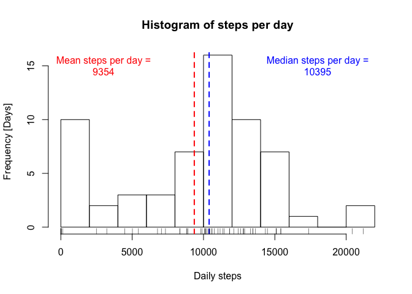

# Reproducible Research: Peer Assessment 1

<style>
   th,td{
     padding: 2px 5px 2px 5px;
   }
</style>

## Loading and preprocessing the data


```r
unzip("activity.zip")
activity <- read.csv("activity.csv")
str(activity)
```

```
## 'data.frame':	17568 obs. of  3 variables:
##  $ steps   : int  NA NA NA NA NA NA NA NA NA NA ...
##  $ date    : Factor w/ 61 levels "2012-10-01","2012-10-02",..: 1 1 1 1 1 1 1 1 1 1 ...
##  $ interval: int  0 5 10 15 20 25 30 35 40 45 ...
```


## What is mean total number of steps taken per day?


```r
library(dplyr, warn.conflicts=FALSE)

stepsByDay <- 
    group_by(activity, date) %>%
    summarise_each(funs(sum(., na.rm=TRUE)), -interval)
```

### Histogram of steps by day

```r
hist(stepsByDay$steps, main="Histogram of steps per day", xlab="Daily steps", ylab="Frequency [Days]", breaks=15)

meanStepsPerDay <- mean(stepsByDay$steps)
abline(v=meanStepsPerDay, col="red", lwd=2, lty=2)
text(paste0("Mean steps per day =\n", round(meanStepsPerDay,0)), x=3000, y=15, col="red")

medianStepsPerDay <- median(stepsByDay$steps)
abline(v=medianStepsPerDay, col="blue", lwd=2, lty=2)
text(paste0("Median steps per day =\n", round(medianStepsPerDay,0)), x=18000, y=15, col="blue")

rug(stepsByDay$steps)
```

<!-- -->

### Summary of steps by day

```r
library(xtable)
summary <- summary(stepsByDay$steps)
print(xtable(t(summary), digits=0), type="html")
```

<!-- html table generated in R 3.3.2 by xtable 1.8-2 package -->
<!-- Thu Apr 20 20:01:13 2017 -->
<table border=1>
<tr> <th>  </th> <th> Min. </th> <th> 1st Qu. </th> <th> Median </th> <th> Mean </th> <th> 3rd Qu. </th> <th> Max. </th>  </tr>
  <tr> <td align="right"> 1 </td> <td align="right"> 0 </td> <td align="right"> 6778 </td> <td align="right"> 10400 </td> <td align="right"> 9354 </td> <td align="right"> 12810 </td> <td align="right"> 21190 </td> </tr>
   </table>

## What is the average daily activity pattern?


```r
stepsByInterval <- 
    group_by(activity, interval) %>%
    summarise_each(funs(mean(., na.rm=TRUE)), -date)

with(stepsByInterval, 
     plot(interval, steps, type="l", xlab="5 min inteval", ylab="Average number of steps", 
          main="Average number of steps by time interval"))
```

<!-- -->


## Imputing missing values


```r
x <- summary(sapply(activity$steps, is.na))
naCount <- as.integer(x[["TRUE"]])
totalCount <- as.integer(x[["FALSE"]]) + naCount
naPerc <- naCount / totalCount * 100
naPerc
```

```
## [1] 13.11475
```

Percentage of records with NA = 13.1%

Strategy - replace NAs with average for time interval.


```r
imputed <- right_join(activity, stepsByInterval, by=c("interval"="interval"), suffix=c(".orig",".imputed"))
imputed$steps <- ifelse(is.na(imputed$steps.orig), imputed$steps.imputed, imputed$steps.orig)
imputed <- select(imputed, date, interval, steps)

activity2 <- 
    right_join(activity, imputed, by=c("date"="date","interval"="interval"), suffix=c(".orig",".imputed")) %>%
    mutate(steps = steps.imputed) %>%
    select(steps, date, interval)

str(activity2)
```

```
## 'data.frame':	17568 obs. of  3 variables:
##  $ steps   : num  1.72 0 0 47 0 ...
##  $ date    : Factor w/ 61 levels "2012-10-01","2012-10-02",..: 1 2 3 4 5 6 7 8 9 10 ...
##  $ interval: int  0 0 0 0 0 0 0 0 0 0 ...
```

New histogram...


```r
stepsByDay2 <- 
    group_by(activity2, date) %>%
    summarise_each(funs(sum(., na.rm=TRUE)), -interval)

hist(stepsByDay2$steps, main="Histogram of steps per day", xlab="Daily steps", ylab="Frequency [Days]", breaks=15)

meanStepsPerDay2 <- mean(stepsByDay2$steps)
abline(v=meanStepsPerDay2, col="red", lwd=2, lty=2)
text(paste0("Mean steps per day =\n", round(meanStepsPerDay2,0)), x=3000, y=15, col="red")

medianStepsPerDay2 <- median(stepsByDay2$steps)
abline(v=medianStepsPerDay2, col="blue", lwd=2, lty=2)
text(paste0("Median steps per day =\n", round(medianStepsPerDay2,0)), x=18000, y=15, col="blue")

rug(stepsByDay2$steps)
```

<!-- -->

**Median increases** from 10395 to 10766 and 
**mean increases** from 9354 to 10766. 
**Days with zero steps** falls.

## Are there differences in activity patterns between weekdays and weekends?
