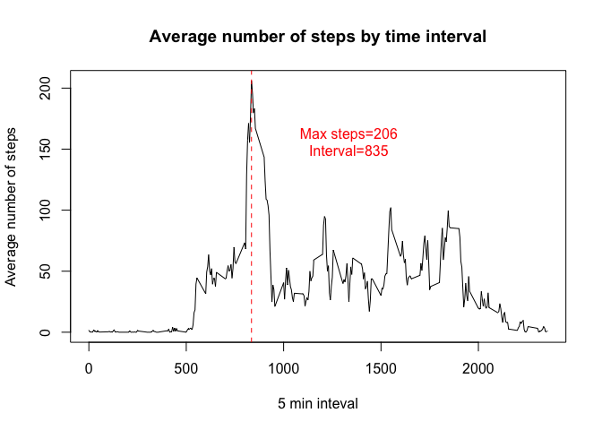
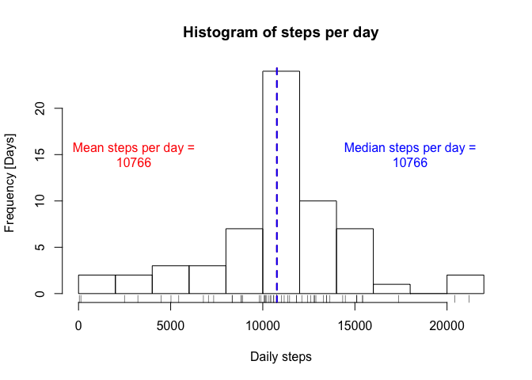
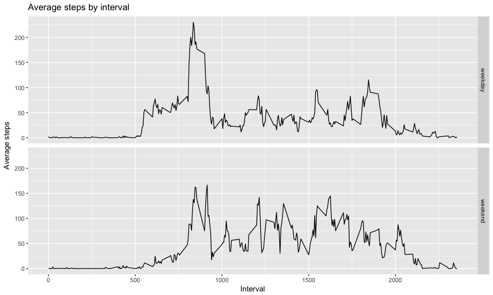

# Reproducible Research: Peer Assessment 1

<style>
   th,td{
     padding: 2px 5px 2px 5px;
   }
</style>

## Loading and preprocessing the data


```r
unzip("activity.zip")
activity <- read.csv("activity.csv")
str(activity)
```

```
## 'data.frame':	17568 obs. of  3 variables:
##  $ steps   : int  NA NA NA NA NA NA NA NA NA NA ...
##  $ date    : Factor w/ 61 levels "2012-10-01","2012-10-02",..: 1 1 1 1 1 1 1 1 1 1 ...
##  $ interval: int  0 5 10 15 20 25 30 35 40 45 ...
```


## What is the mean total number of steps taken per day?


```r
library(dplyr, warn.conflicts=FALSE)

# Calculate the total number of steps for each day...
stepsByDay <- 
    group_by(activity, date) %>%
    summarise_each(funs(sum(., na.rm=TRUE)), -interval)
```


```r
# Show the histogram...
hist(stepsByDay$steps, main="Histogram of steps per day", xlab="Daily steps", ylab="Frequency [Days]", breaks=15)
rug(stepsByDay$steps)

# Add vertical line for mean...
meanStepsPerDay <- mean(stepsByDay$steps)
abline(v=meanStepsPerDay, col="red", lwd=2, lty=2)
text(paste0("Mean steps per day =\n", round(meanStepsPerDay,0)), x=3000, y=15, col="red")

# Add vertical line for median...
medianStepsPerDay <- median(stepsByDay$steps)
abline(v=medianStepsPerDay, col="blue", lwd=2, lty=2)
text(paste0("Median steps per day =\n", round(medianStepsPerDay,0)), x=18000, y=15, col="blue")
```

<!-- -->

### Summary of steps by day

```r
library(xtable)
summary <- summary(stepsByDay$steps)
print(xtable(t(summary), digits=0), type="html")
```

<!-- html table generated in R 3.3.2 by xtable 1.8-2 package -->
<!-- Thu Apr 20 22:09:01 2017 -->
<table border=1>
<tr> <th>  </th> <th> Min. </th> <th> 1st Qu. </th> <th> Median </th> <th> Mean </th> <th> 3rd Qu. </th> <th> Max. </th>  </tr>
  <tr> <td align="right"> 1 </td> <td align="right"> 0 </td> <td align="right"> 6778 </td> <td align="right"> 10400 </td> <td align="right"> 9354 </td> <td align="right"> 12810 </td> <td align="right"> 21190 </td> </tr>
   </table>

## What is the average daily activity pattern?


```r
# Calculate the mean steps for each 5min interval...
stepsByInterval <- 
    group_by(activity, interval) %>%
    summarise_each(funs(mean(., na.rm=TRUE)), -date)
maxSteps <- max(stepsByInterval$steps)
maxInterval <-
    stepsByInterval[stepsByInterval$steps == maxSteps,]$interval

# ... and plot.
with(stepsByInterval, {
     plot(interval, steps, type="l", xlab="5 min inteval", ylab="Average number of steps", 
          main="Average number of steps by time interval")
     abline(v=maxInterval, lty=2, col="red")
     text(paste0("Max steps=",as.integer(maxSteps),"\nInterval=", as.integer(maxInterval)), x=maxInterval + 500, y=maxSteps - 50, col="red")
})
```

<!-- -->


## Imputing missing values

### Evaluation

```r
x <- summary(sapply(activity$steps, is.na))
naCount <- as.integer(x[["TRUE"]])
totalCount <- as.integer(x[["FALSE"]]) + naCount
naPerc <- naCount / totalCount * 100
```

&nbsp; | Value
--- | ---
Total Count | 17568
NA Count | 2304
Percentage NA | 13.1 %

> ### Missing values strategy
> Step counts containing NA values will be replaced with the average for that time interval
> using `stepsByInterval` from above.


```r
# Impute the NA values...
imputed <- right_join(activity, stepsByInterval, by=c("interval"="interval"), suffix=c(".orig",".imputed"))
imputed$steps <- ifelse(is.na(imputed$steps.orig), imputed$steps.imputed, imputed$steps.orig)
imputed <- select(imputed, date, interval, steps)

# Create a new data frame with the imputed values...
activity2 <- 
    right_join(activity, imputed, by=c("date"="date","interval"="interval"), suffix=c(".orig",".imputed")) %>%
    mutate(steps = steps.imputed) %>%
    select(steps, date, interval)
```

### Results of imputing NAs


```r
# Calculate the new values for each interval...
stepsByDay2 <- 
    group_by(activity2, date) %>%
    summarise_each(funs(sum(., na.rm=TRUE)), -interval)
meanStepsPerDay2 <- mean(stepsByDay2$steps)
medianStepsPerDay2 <- median(stepsByDay2$steps)

# Show new histogram...
hist(stepsByDay2$steps, main="Histogram of steps per day", xlab="Daily steps", ylab="Frequency [Days]", breaks=15)
rug(stepsByDay2$steps)

# Add vertical lines for mean and median...
abline(v=meanStepsPerDay2, col="red", lwd=2, lty=2)
text(paste0("Mean steps per day =\n", round(meanStepsPerDay2,0)), x=3000, y=15, col="red")
abline(v=medianStepsPerDay2, col="blue", lwd=2, lty=2)
text(paste0("Median steps per day =\n", round(medianStepsPerDay2,0)), x=18000, y=15, col="blue")
```

<!-- -->

&nbsp; | With NAs | With Imputed Values
--- | --- | ---
Median steps | 10395 | 10766
Mean steps | 9354 | 10766
Total steps | 570608 | 656737

> ### Conclusion
> The mean and median both increase because the number of days without any steps drops from 10 to 1.
> The **total number of steps increases by 86129.**

## Are there differences in activity patterns between weekdays and weekends?


```r
# Add daytype factor to dataframe with imputed values...
activity2$daytype <- 
    as.factor(
        ifelse(
            weekdays(as.POSIXlt(activity2$date), abbreviate=TRUE) %in% c("Sat", "Sun"), 
            "weekend", "weekday"))

# Calcuate steps per interval for weekdays and weekends...
stepsByIntervalAndDayType <- 
    group_by(activity2, daytype, interval) %>%
    summarise_each(funs(mean(., na.rm=TRUE)), -date)

library(ggplot2)
g <- ggplot(stepsByIntervalAndDayType, aes(interval, steps)) +
    geom_line() +
    facet_grid(daytype ~ .) + 
    ggtitle("Average steps by interval") + 
    xlab("Interval") +
    ylab("Average steps")
print(g)
```

<!-- -->


```r
weekdays <- subset(stepsByIntervalAndDayType, daytype=="weekday")
avgWeekday <- mean(weekdays$steps)

weekends <- subset(stepsByIntervalAndDayType, daytype=="weekend")
avgWeekend <- mean(weekends$steps)
```
Days  | Mean steps per interval
--- | ---
Weekdays | 35
Weekends | 42

> ### Conclustion
> More steps are taken (42 versus 35 
> per interval) , on average, on weekend days and the steps are distributed
> more evenly throughout the day.
